# California beach board — UX audit

Reviewed the public board at `/california` (the same presentation as `/sandbox`) on October 9, 2026, against the published South Bay files. The page is server-rendered from `nowcast_latest.csv`, `forecast_3day.csv`, `history_3day.csv`, `accuracy.csv`, and `thresholds.csv`. Those column formats were not changed.

Coverage that day was **19 beaches** (Los Angeles and Orange County). The roster in `lib/data.ts` is larger; `lib/californiaCoverage.ts` is what the board actually shows. Screenshots are desktop (1440×900) and mobile (390×844).

## What a reader has to figure out

The board opens on a statewide map titled “Neptune Index,” with a date and three colored words: Low risk, Moderate risk, High risk. The percentage, the 104 MPN/100 mL enterococcus standard, the age of the last lab test, and the fact that the next three days are not the validated model are all easy to miss.

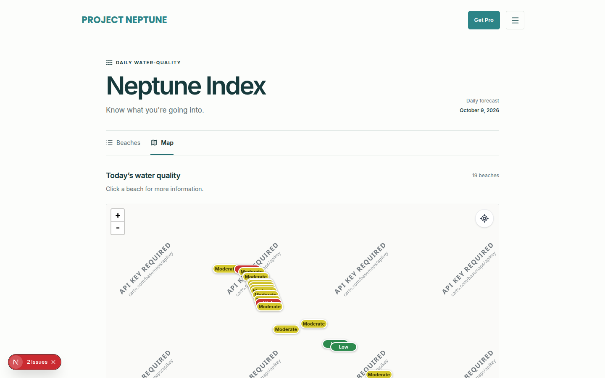

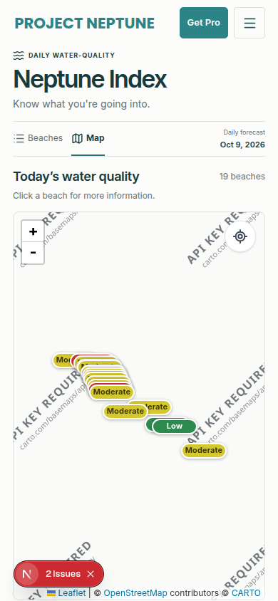

## Findings

Ordered by how much they get in the way of deciding whether to go in the water.

### 1. “Low / Moderate / High risk” does not say risk of what

The list, the map legend, and the beach hero all used “Low risk,” “Moderate risk,” and “High risk.” The hero sentence talked about a “swimming threshold” without naming enterococcus or 104 MPN/100 mL. The percentage underneath was “chance of unsafe bacteria levels,” which sounds like a safety verdict.

The key under the percentage made this worse. It has four bands (0–29, 30–49, 50–74, 75–100) while the status has three, and a 50% day read “High risk” next to a row called “Very high bacteria levels.”

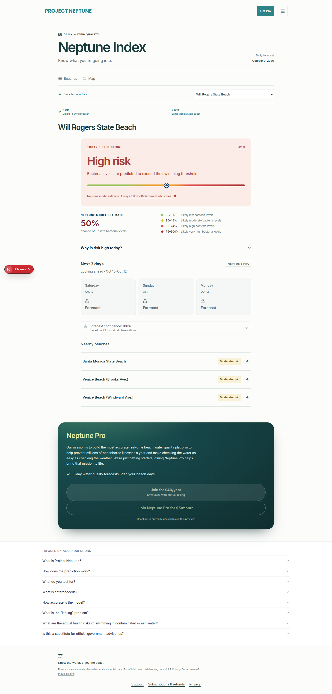

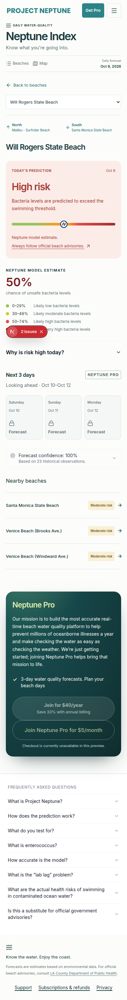

The cutoffs themselves (30 and 50) already live in `RISK_TIERS` in `lib/data.ts`. The words around them did not, so a later calibration would have had to be edited in the component copy as well as the table.

### 2. The next three days look like the same product as today

Today’s reading and the 1–3 day forecast shared one hero. Picking Saturday replaced “Today’s prediction” with another “Low/Moderate/High risk” card. The modeling note is that those look-ahead days have no real skill live; the same-day nowcast is the validated model. Nothing on the page said so. For a free reader the three days were locked “Forecast” tiles with a Pro badge, which reads as “the same forecast, pay to see it.”

### 3. Accuracy was labeled as confidence

Beach detail headlined “Forecast confidence: NN%.” On a usually-clean beach that match rate can be very high (Seal Beach was 16 of 16) even when the rare unsafe days are the ones that matter. “Confidence” reads as a guarantee about today. The FAQ said the model “performs well.”

### 4. No way to find a beach, and it will not survive 500

Nineteen beaches are grouped into hardcoded county lists. There was no search. Dockweiler alone is four long names. At a few hundred beaches the list is a scroll and the map is a cluster of overlapping pins around Los Angeles, which is already true at 19.

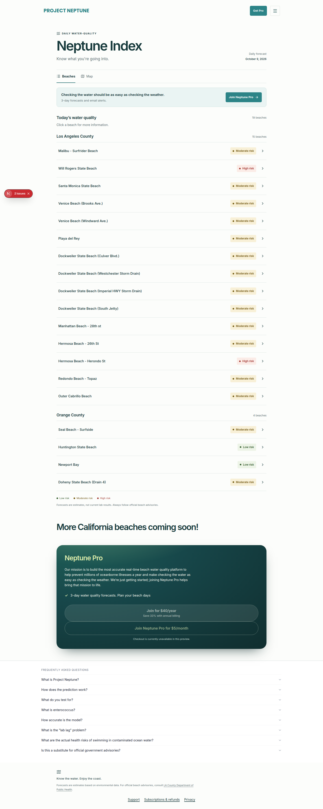

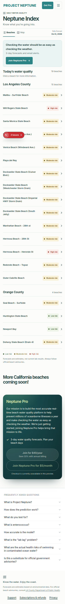

Counties that are not in the hardcoded list fall through to “Other beaches.” That is a scaling problem separate from search.

### 5. Lab age was in the file and not on the screen

Every covered beach has `days_since_sample`. On this day it ran from 4 days (several Los Angeles beaches) to 73–74 days (Seal Beach, Huntington, Newport Bay, Doheny). The list and the hero did not show it. “Taken 73 days ago” existed only inside the contributing-factors disclosure, under the lab result.

There is no `no_recent_sample` column in the California nowcast, and no separate “limited data” field. A limited-data notice has to be derived from the age that is already published, and it has to look ordinary: most beaches in a statewide board will be sampled sparsely (median about 23 sample days a year). A red badge would mark the normal case as an emergency.

### 6. “Last updated” was only a forecast date, with no stale state

The corner said “Daily forecast / October 9, 2026.” That date is `prediction_date`. The nowcast does **not** publish `generated_at` (the parser already accepts the column; this file does not have it). `public/data/southbay/today.json` has a `generated_at`, but that file is a marketing-widget stamp for one flagship station, not the board’s model run, so it is not shown as the board’s clock time.

If `prediction_date` were yesterday, the only signal was that same quiet date. There was no “this is not today” line.

### 7. Loading, empty, and error states

- **Empty data:** “No readings published yet.” Clear enough. Not exercised with a screenshot; it only renders when the roster comes back empty.
- **Map loading:** a gray box with `aria-hidden`, so a screen reader got silence while Leaflet loaded.
- **Page loading:** no `loading.tsx`. The route is `force-dynamic`, so a slow data read was a blank navigation.
- **Errors:** no route error boundary. A thrown load became the generic root error page.
- **Search miss / filter miss:** there was no search, so there was no empty-result state.

### 8. Accessibility

What already worked: status text next to color, a labeled beach `<select>`, visible focus rings, `aria-current` on the view tabs, and an accessible name on the location button.

Gaps:

- Map pins exposed the beach name (`title`) and not the status. The drawn word is “Low” / “Moderate” / “High,” which is easy to miss in a cluster.
- The probability scale bar is deliberately unlabeled (`aria-hidden`). The number sits in a different section, so the marker’s position is unexplained.
- Several list controls were `<button>` without `type="button"`.
- Muted gray (`#607174`) on the page background is close to the small-text contrast floor. Freshness lines needed a darker gray.

### 9. Mobile

No horizontal overflow at 390px. The real cost is vertical: logo, “Get Pro,” a 34px “Neptune Index,” tabs, and a date before the map. Status pills and long beach names share a row. The three forecast days stay in one row and get cramped. Those are acceptable at 19 beaches and get worse as names and counties multiply. Search has to be a full-width field at 16px so iOS does not zoom on focus.

### 10. Performance

Nineteen rows and one Leaflet map are fine. The list is not virtualized. County assignment is a hand-maintained code list. Neither will fall over at 500 DOM nodes, but a filter has to be the way in, and the map should zoom to the matches instead of always fitting the whole state.

## Priority

| Priority | Change | In this PR |
| --- | --- | --- |
| P0 | Plain-language status, and a percentage caption that names 104 MPN/100 mL and says it is an estimate | Yes |
| P0 | Keep band cutoffs in `RISK_TIERS` only; status classification reads that table | Yes |
| P0 | Calm “Experimental” label on day 1–3, visually separate from today. One switch to hide them instead. Empty per-station hide list | Yes |
| P0 | Stop headlining accuracy as “forecast confidence” on this board | Yes |
| P0 | Beach search that filters the list and the map | Yes |
| P0 | “Last tested N days ago,” and a calm limited-lab line when the last test is older than a week | Yes |
| P1 | Visible “Last updated,” using `generated_at` when the pipeline sends it, otherwise the forecast date. Banner when that date is not today | Yes |
| P1 | Route loading and error UI; map loading announced | Yes |
| P1 | Pin accessible name includes the status phrase | Yes |
| P2 | Draw the new words on the map pins (they still say Low / Moderate / High so the pin footprint stays put) | No |
| P2 | Virtualize the list, and stop hardcoding counties | No |
| P2 | A real per-beach confidence flag, once a field exists | No — not invented |
| P2 | Rewrite the Pro mission line (“the most accurate…”) | No |

## What changed

Display copy for status, probability, sample age, and the limited-lab sentence is in `lib/waterStatus.ts`. Band numbers stay in `RISK_TIERS`. `statusFromProb` now uses that table’s first two cutoffs (still 30 and 50), so a calibration edits one array.

Look-ahead behavior is `lib/forecastDisplay.ts`:

- `FORECAST_HORIZON_MODE` is `"label"` or `"hide"`. Default `"label"`. `"hide"` removes the 1–3 day block and the Pro/banner lines that would promise it. Today’s reading stays.
- `FORECAST_HIDDEN_STATIONS` is an empty list of station codes. A code in that list hides that beach’s look-ahead even while the mode is `"label"`, and the page says a multi-day forecast isn’t shown for that beach. Nothing is hidden by default.

Today’s hero no longer swaps out when a future day is selected. The next three days sit in a dashed panel with an “Experimental” label and one sentence: they are still being tested, and today’s reading is the one checked against lab samples. Locked Pro days stay inside that panel, so the caveat is visible before checkout.

“Last tested N days ago” uses `days_since_sample` only. “Limited lab data” is an extra calm sentence when that age is over 7 days, or when `no_recent_sample` is true. It is muted body text, not a warning chip. Beaches tested within the week get the age and not the limited-lab sentence. There is no invented confidence score; the sample-age block is where one would go later.

The header says “Last updated” and the forecast date. If a row ever includes `generated_at`, the same line adds the clock time in the board’s timezone. If the forecast date is before today in that timezone, a plain banner says the readings are not for today.

Search matches beach name and county, announces the count, and says when nothing matches. On the map, the pins zoom to the matches.

The California accuracy panel is titled “Past lab agreement” and states the match count (“Matched 16 of 16 past lab samples. Not a guarantee for today.”) instead of a confidence percentage. Other boards still use the old headline.

### After

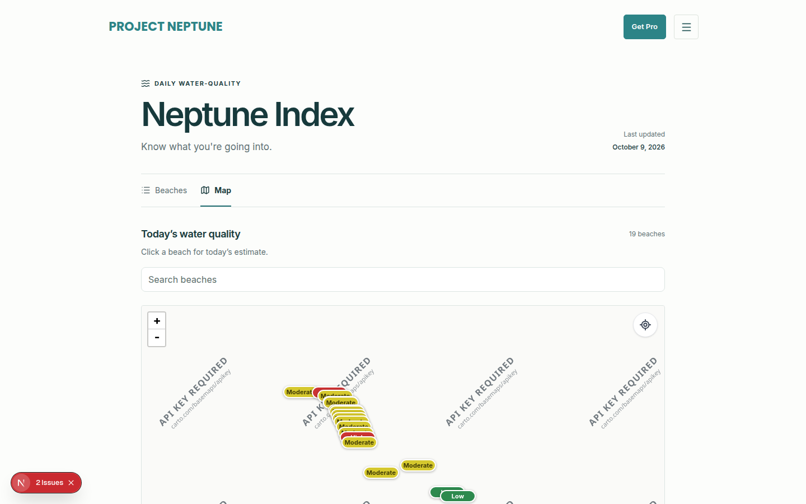

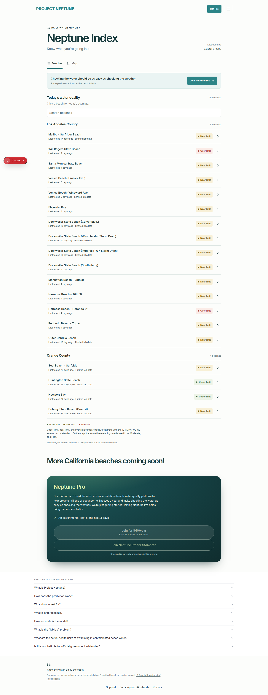

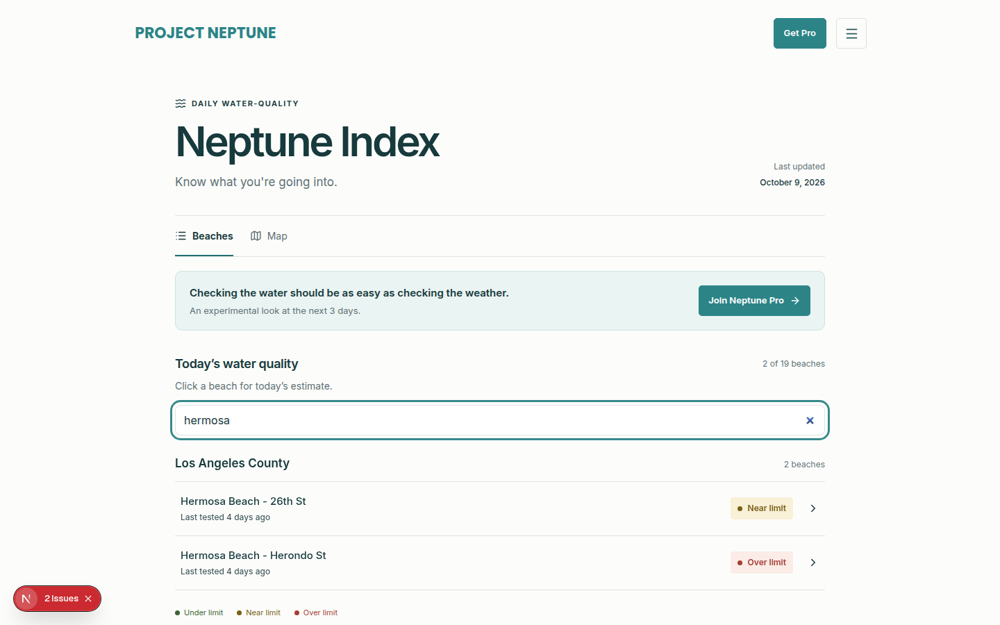

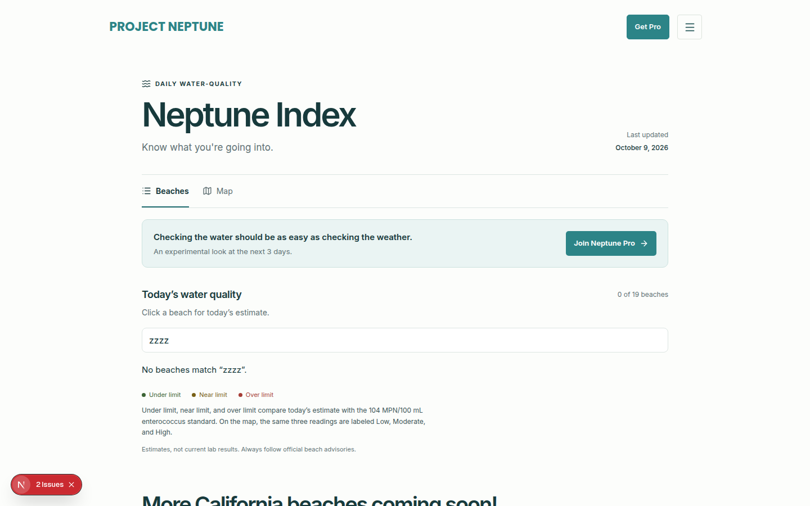

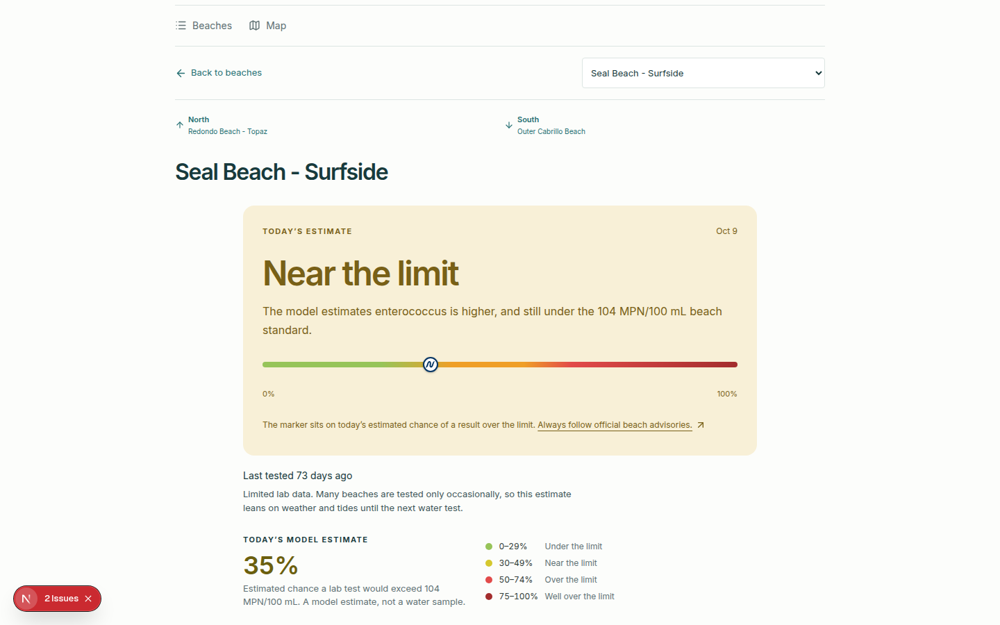

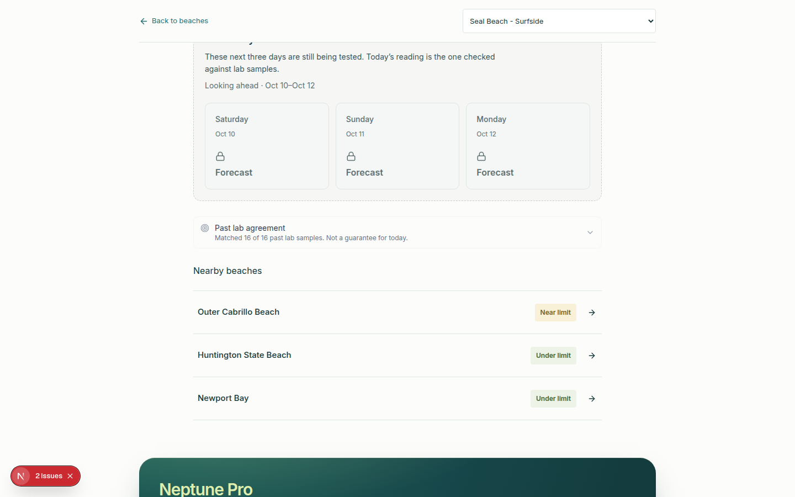

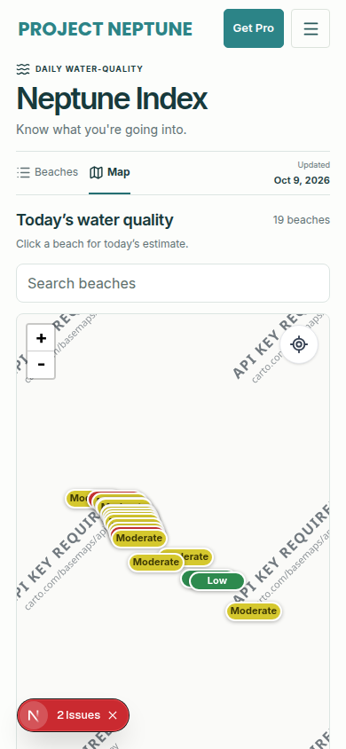

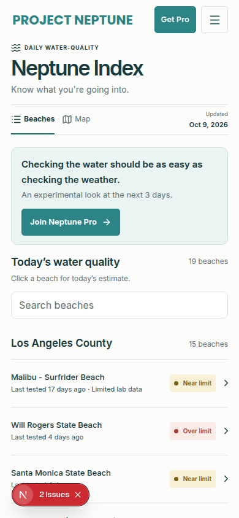

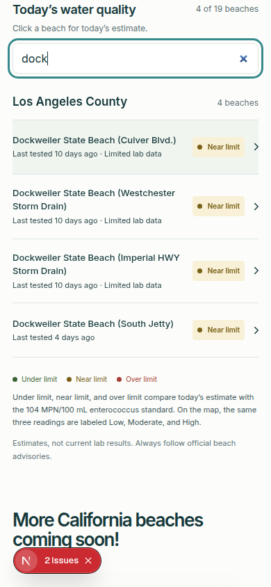

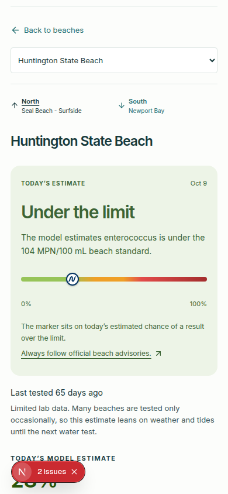

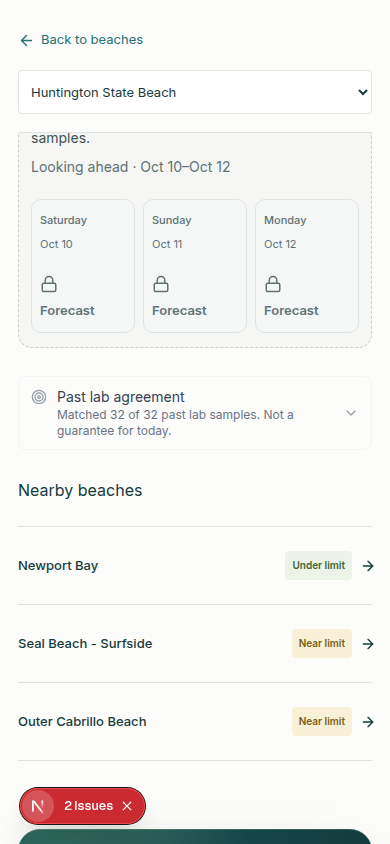

Document width at 390px did not overflow on the map, the list, a beach, or a search.

## Left alone on purpose

- CSV and JSON column formats, station codes, and the paywall’s field stripping.
- No production deploy and no merge.
- No fake per-beach confidence or limited-data flag beyond `days_since_sample` and `no_recent_sample`.
- Map pin artwork still says Low / Moderate / High. The legend under the map says those mean under the limit, near it, and over it. Changing the pin string would resize a footprint the label placer assumes is fixed.
- `today.json`’s `generated_at` is not shown. It is not the board’s run time.
